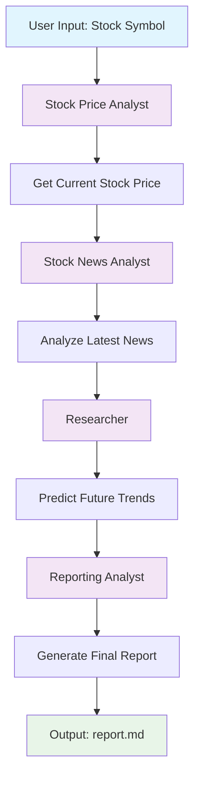

# CrewAI Workflow Chart

```mermaid
graph TD
    A[User Input: Stock Symbol] --> B[Stock Price Analyst]
    B --> B1[Get Current Stock Price]
    B1 --> C[Stock News Analyst]
    C --> C1[Analyze Latest News]
    C1 --> D[Researcher]
    D --> D1[Predict Future Trends]
    D1 --> E[Reporting Analyst]
    E --> E1[Generate Final Report]
    E1 --> F[Output: report.md]
    
    style A fill:#e1f5fe
    style B fill:#f3e5f5
    style C fill:#f3e5f5
    style D fill:#f3e5f5
    style E fill:#f3e5f5
    style F fill:#e8f5e8
```
